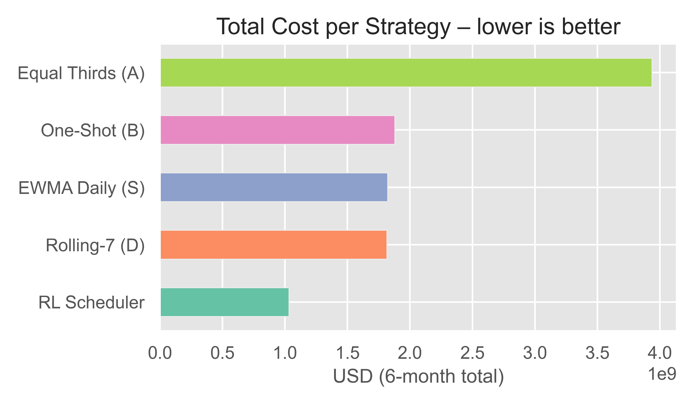

<h1 align="center">Quantum-Compute Optimization 🚀</h1>
<p align="center">
  <em>Cutting QPU costs with clever heuristics&nbsp;+&nbsp;Reinforcement Learning</em>
</p>

<p align="center">
  <!-- badges -->
  <a href="https://github.com/tej-kodur/Quantum-Compute-Optimization/actions">
    
  </a>
  
  
  
</p>

<p align="center">
  <!-- binder -->
  <a href="https://mybinder.org/v2/gh/tej-kodur/Quantum-Compute-Optimization/HEAD?labpath=notebooks%2F01_data_simulation.ipynb">
    
  </a>
</p>

---


## ✨ Key Results

| Strategy | 6-Month Cost | Δ vs Baseline B |
|----------|--------------|-----------------|
| **RL Scheduler (DQN)** | **\$1.03 B** | **-45 %** |
| Rolling-7 Greedy (D)   | \$1.82 B | -3 % |
| One-Shot Break-Even (B)| \$1.88 B | — |
| Equal-Thirds (A)       | \$3.94 B | +110 % |

<p align="center">
  
</p>

---

## 🛠️ Quick Start
```bash
git clone https://github.com/tej-kodur/Quantum-Compute-Optimization.git
cd Quantum-Compute-Optimization
python -m venv .venv && source .venv/bin/activate   # Windows: .venv\Scripts\activate
pip install -r requirements.txt
jupyter lab                                         # run notebooks 01 → 05
```

> **No GPU?** Training the RL agent (Notebook 04) takes ~3 min on CPU.

---

## 📂 Project Structure
```text
notebooks/         reproducible Jupyter pipeline
provider_configs/  YAML price sheets
models/            pre-trained DQN agent (Git-LFS tracked)
results/           Parquet metrics & CSV summary
figures/           600-dpi plots for reports
cost_model.py      reusable pricing helper
```

---

## 🧮 Methodology
1. **Simulation (01)** – generate 6 months of synthetic QPU leases & workloads  
2. **Cost Model (02)** – YAML-driven fee engine (lease, exec, trigger, transfer)  
3. **Heuristics (03)** – Baseline A, Baseline B, and two greedy retag strategies  
4. **RL Scheduler (04)** – Gym env per block, DQN learns when to retag  
5. **Results (05)** – daily curves, bar chart, pair-wise heat-map, summary CSV  


---

## 📈 Roadmap
```text
[x] Deterministic heuristics  
[x] DQN agent  
[ ] PPO comparison  
[ ] Real-world dataset (AWS / Azure)  
[ ] Docker image & CLI tool  
```

---

## 🤝 Contributing
```text
1. Fork the repo & create a feature branch  
2. Add tests / notebook demo  
3. Open a pull request — we love new strategies!  
```

---

## 📜 License
This project is licensed under the [MIT License](LICENSE).


---

## 📖 Citation
```text
@software{Kodur_2025_QPU_Opt,
  author  = {Tej Kodur},
  title   = {Quantum-Compute Optimization},
  year    = 2025,
  url     = {https://github.com/tej-kodur/Quantum-Compute-Optimization}
}
```

---

<p align="center"><i>Happy cost-crunching! ⚡️</i></p>
